# KLynx+

# Overview

KLynx is a web and mobile Electronic Medical Record (EMR) System that helps clinics efficiently manage patients, appointments, healthcare services and administrative operations. The system replaces manual processes with a centralized, user-friendly platform that improves workflow efficiency, data accessibility and overall patient management.

---

# Features ✨

## Authentication / Login Page
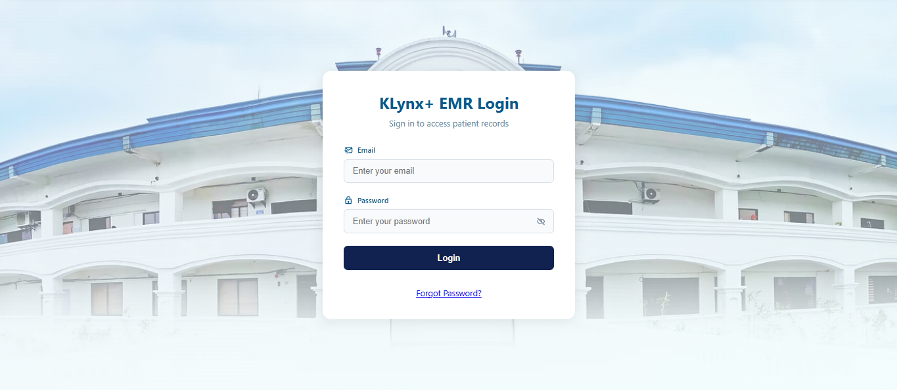
- Secure user authentication
- Role-based access control
- Session management

## Patient Management Module
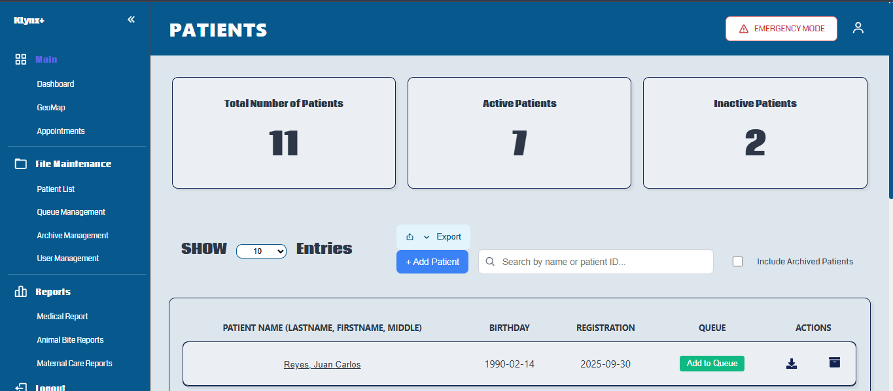
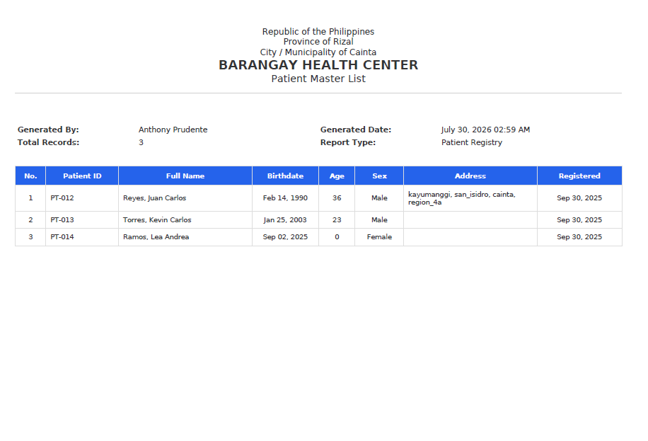
- Register and manage patient records 
- Search and filter patients 
- Printable patient information export

## Patient Visit Details Module
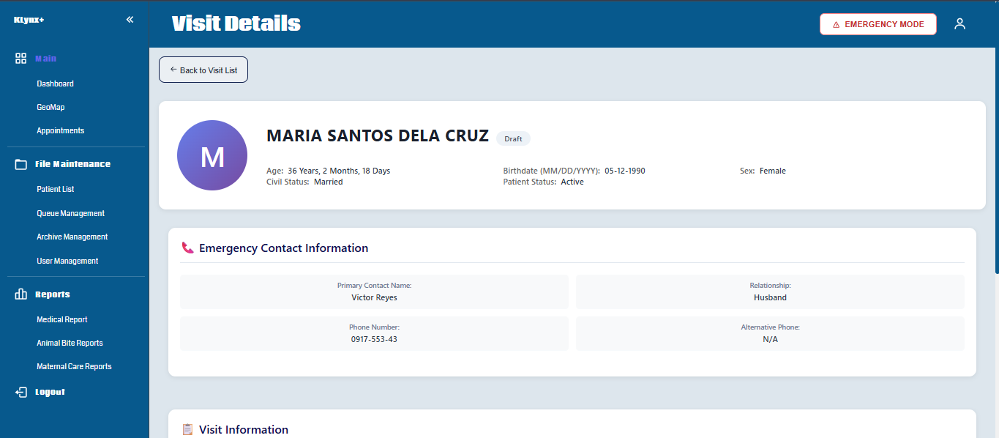
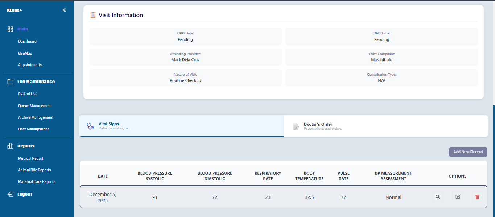
- Record and manage patient visit details
- Document services provided during each visit
- View patient service history

## Appointment Management Module
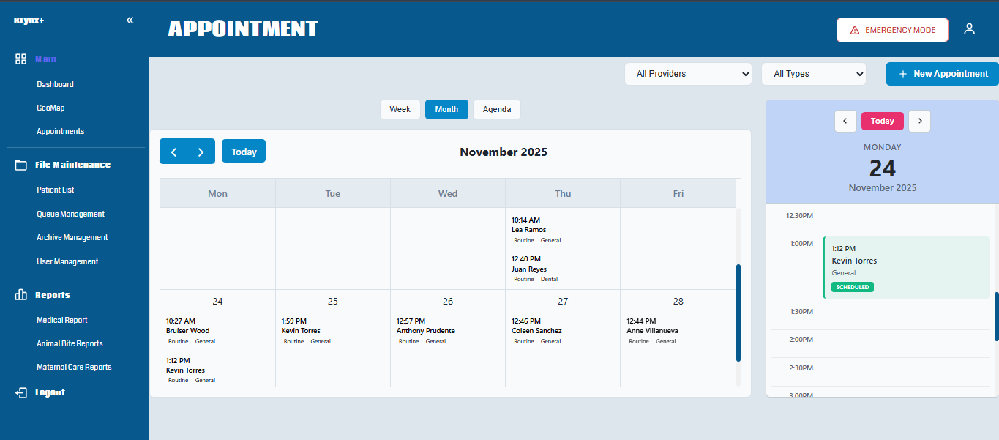
- Schedule appointments 
- Manage appointment status 
- View appointment history

## Queue Management Module
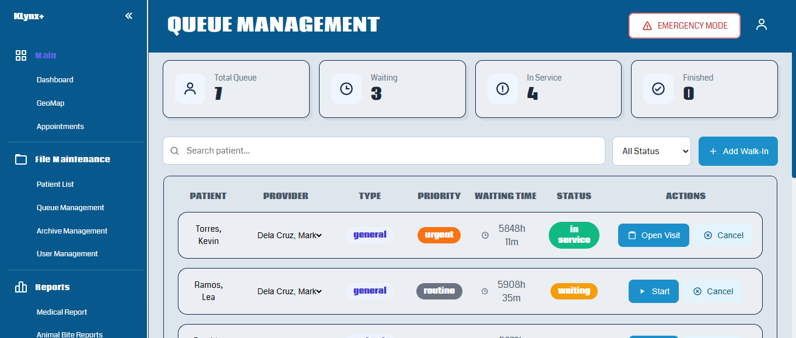
- Manage patient queues 
- Register a patient's visit
- Track queue status 
- Streamline patient flow

## GeoMap 
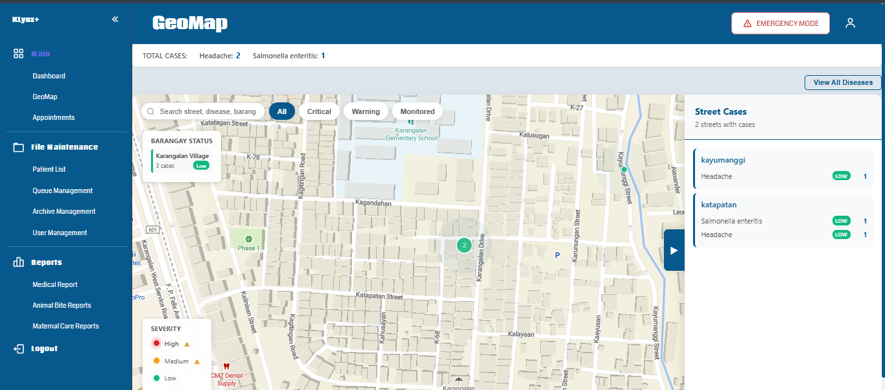
- Interactive map for tracking reported disease cases by street
- Visualizes disease distribution to help identify affected areas

## User Management Module 
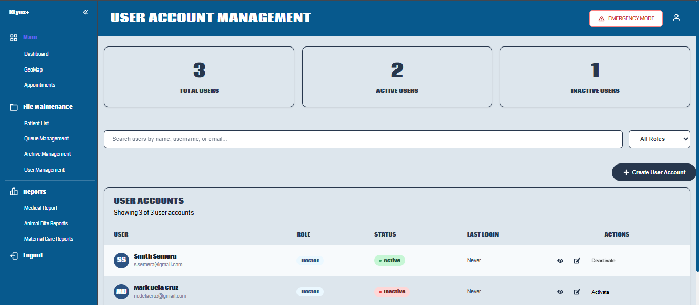
- Create and manage user accounts 
- Manage user roles and permissions

## 🗃️ Archive Module 
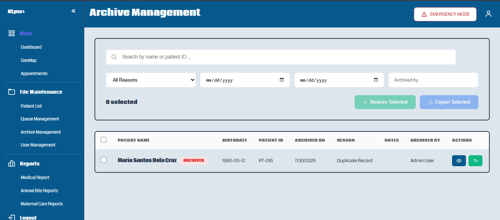 
- Archive inactive patient records 
- Restore archived records when needed 
- Preserve historical data while keeping active records organized

## System Settings 
- Manage system configuration and application preferences

## Dashboard Module
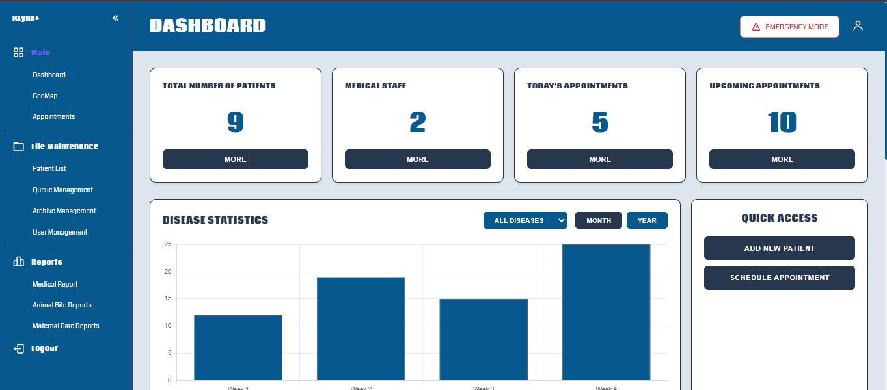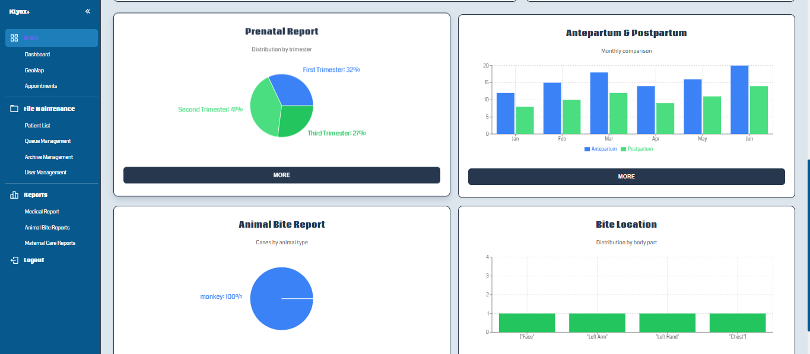
- Clinic overview
- Quick access to system modules 
- Key operational insights

---

# Technologies Used 🛠️
 ## Frontend 
 - React 
 - Javascript 
 - Vite 
 
 ## Backend 
 - Node.js 
 - REST API 
 
 ## Database
 - MySQL 
 
 ## Development Tools 
 - Git 
 - GitHUb
 - Visual Studio Code

